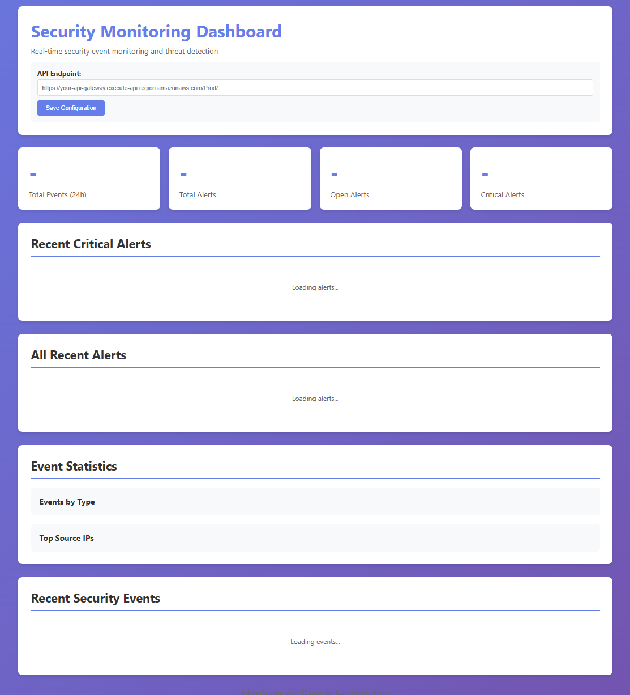

# Serverless Security Monitoring Dashboard


A real-time security monitoring system built with AWS serverless technologies. This project demonstrates cloud architecture best practices and security monitoring capabilities using AWS Lambda, DynamoDB, CloudWatch, and SNS.

## 🎥 Live Demo

**Watch the system in action:** [3-minute demo video](https://youtu.be/ilQ55ZIacQ8)

See real-time threat detection, Slack notifications, and the complete workflow from event ingestion to alert generation.

## Features

- **Real-time Event Ingestion**: Automatically ingests security events from various sources
- **Intelligent Threat Detection**: 11 built-in detection rules for common security threats:
  - Brute force attacks
  - Suspicious IP detection
  - Privilege escalation attempts
  - Data exfiltration
  - Port scanning and directory traversal
  - Anomalous time access
  - Failed authentication monitoring
  - SQL injection detection
  - API rate limiting violations
  - Credential stuffing attacks
  - Geo-location anomalies
- **Automated Alerting**: Slack and SNS notifications for MEDIUM, HIGH and CRITICAL severity alerts
- **Interactive Dashboard**: Real-time web dashboard for visualizing security events and alerts
- **Scalable Architecture**: Fully serverless with automatic scaling
- **Cost-Effective**: Pay only for what you use with AWS serverless services

## Dashboard Preview



*Real-time security event monitoring with threat detection alerts, event analytics, and live statistics*

## Quick Start

Deploy in minutes with AWS SAM:

```powershell
# Clone and deploy
git clone https://github.com/hackn3y/security-monitor-dash.git
cd security-monitor-dash
sam build && sam deploy --guided

# Test with traffic simulator
python scripts/traffic-simulator.py --endpoint YOUR_API_ENDPOINT --scenario all
```

See [QUICKSTART.md](QUICKSTART.md) for detailed setup instructions.

## Cost Breakdown

Estimated monthly costs for moderate usage (100K events/month):

| Service | Usage | Estimated Cost |
|---------|-------|----------------|
| Lambda | 1M requests, 512MB, 30s avg | $5-10 |
| DynamoDB | On-demand, 100K writes, 500K reads | $5-15 |
| API Gateway | 1M requests | $3-7 |
| CloudWatch | Logs, metrics, alarms | $1-5 |
| S3 | Dashboard hosting, logs | <$1 |
| SNS | Email notifications | <$1 |
| **Total** | | **$15-40/month** |

*Costs scale automatically with usage. 30-day TTL on events keeps storage costs low.*

## Architecture

### Components

1. **Log Ingestion Lambda** (`src/ingestion/`)
   - Receives security events via API Gateway POST requests
   - Auto-generates simulated events every minute for testing
   - Stores events in DynamoDB with 30-day TTL
   - Sends metrics to CloudWatch

2. **Threat Detection Lambda** (`src/detection/`)
   - Triggered by DynamoDB Streams on new events
   - Analyzes events against multiple security rules
   - Creates alerts for detected threats
   - Sends SNS notifications for critical alerts

3. **Alert Management Lambda** (`src/alerts/`)
   - Manages alert lifecycle and status updates
   - Sends formatted notifications via SNS
   - Provides API for alert acknowledgment and resolution

4. **Dashboard API Lambda** (`src/dashboard/`)
   - RESTful API for dashboard data
   - Endpoints for events, alerts, and statistics
   - Real-time aggregations and filtering

5. **DynamoDB Tables**
   - `SecurityEvents`: Stores all security events with GSI on sourceIp
   - `SecurityAlerts`: Stores generated alerts with GSI on severity

6. **CloudWatch & SNS**
   - Custom metrics for monitoring
   - SNS topic for email/SMS alerts
   - CloudWatch alarms for critical conditions

### Data Flow

```
External Sources → API Gateway → Ingestion Lambda → DynamoDB Events Table
                                                             ↓
                                                       DynamoDB Stream
                                                             ↓
                                                   Detection Lambda
                                                             ↓
                                            ┌────────────────┴────────────────┐
                                            ↓                                 ↓
                                    Alerts Table                          SNS Topic
                                            ↓                                 ↓
                                    Dashboard API                     Email/SMS Alerts
                                            ↓
                                    Web Dashboard
```

## Prerequisites

- AWS Account with appropriate permissions
- AWS CLI configured with credentials
- AWS SAM CLI installed
- Python 3.9+ (for traffic simulator)
- S3 bucket for deployment artifacts

### Installing AWS SAM CLI

**macOS/Linux:**
```bash
brew install aws-sam-cli
```

**Windows:**
```powershell
# Using Chocolatey
choco install aws-sam-cli

# Or download MSI installer from:
# https://docs.aws.amazon.com/serverless-application-model/latest/developerguide/install-sam-cli.html
```

## Deployment

### Option 1: Automated Deployment (Recommended)

**Linux/macOS:**
```bash
chmod +x scripts/deploy.sh
./scripts/deploy.sh
```

**Windows PowerShell:**
```powershell
.\scripts\deploy.ps1
```

The script will:
1. Build the SAM application
2. Package and upload to S3
3. Deploy the CloudFormation stack
4. Upload the dashboard to S3
5. Configure SNS email subscriptions

### Option 2: Manual Deployment

```bash
# 1. Build the application
sam build

# 2. Deploy with guided prompts
sam deploy --guided

# 3. Upload dashboard to S3 bucket (get bucket name from stack outputs)
aws s3 cp dashboard/index.html s3://YOUR-DASHBOARD-BUCKET/index.html

# 4. Subscribe to SNS topic
aws sns subscribe \
    --topic-arn YOUR-SNS-TOPIC-ARN \
    --protocol email \
    --notification-endpoint your-email@example.com
```

## Configuration

### 1. Dashboard Setup

1. Open the Dashboard URL from deployment outputs
2. Enter your API Gateway endpoint in the configuration section
3. Click "Save Configuration"
4. The dashboard will start displaying real-time data

### 2. SNS Alerts

1. Check your email for SNS subscription confirmation
2. Click the confirmation link
3. You'll now receive alerts for HIGH and CRITICAL threats

### 3. Custom Event Sources

Send events to the ingestion API:

```bash
curl -X POST https://YOUR-API-ENDPOINT/ingest \
  -H "Content-Type: application/json" \
  -d '{
    "eventType": "authentication",
    "action": "login_failed",
    "sourceIp": "192.168.1.100",
    "user": "admin",
    "resource": "/api/login",
    "statusCode": 401
  }'
```

## Testing

### Traffic Simulator

The included traffic simulator generates realistic security events for testing:

```bash
# Install dependencies
pip install requests

# Run full simulation (all attack scenarios)
python scripts/traffic-simulator.py \
    --endpoint https://YOUR-API-ENDPOINT \
    --scenario all

# Run specific scenarios
python scripts/traffic-simulator.py \
    --endpoint https://YOUR-API-ENDPOINT \
    --scenario brute-force

# Generate normal traffic only
python scripts/traffic-simulator.py \
    --endpoint https://YOUR-API-ENDPOINT \
    --scenario normal \
    --count 50
```

### Available Scenarios

- `all`: Complete simulation with all attack types
- `normal`: Generate legitimate traffic
- `brute-force`: Simulate brute force attacks
- `suspicious-ip`: Access from suspicious IPs
- `scanning`: Port scanning and directory traversal
- `privilege-escalation`: Unauthorized admin actions
- `exfiltration`: Large data transfers
- `anomalous-time`: Off-hours access to sensitive resources

## Security Rules

### 1. Brute Force Detection
- **Trigger**: 5+ failed login attempts from same IP in 5 minutes
- **Severity**: HIGH
- **Response**: Alert + SNS notification

### 2. Suspicious IP Detection
- **Trigger**: Request from known malicious IP ranges
- **Severity**: MEDIUM
- **Response**: Alert

### 3. Privilege Escalation
- **Trigger**: Non-admin user attempting admin actions
- **Severity**: CRITICAL
- **Response**: Alert + SNS notification

### 4. Data Exfiltration
- **Trigger**: Data transfer > 10MB
- **Severity**: HIGH
- **Response**: Alert + SNS notification

### 5. Network Scanning
- **Trigger**: Port scanning or directory traversal attempts
- **Severity**: MEDIUM
- **Response**: Alert

### 6. Anomalous Time Access
- **Trigger**: Sensitive resource access during 2-5 AM UTC
- **Severity**: LOW
- **Response**: Alert

### 7. Failed Authentication on Privileged Accounts
- **Trigger**: Failed login on admin/root accounts
- **Severity**: MEDIUM
- **Response**: Alert

## Monitoring

### CloudWatch Metrics

Custom metrics in the `SecurityMonitoring` namespace:
- `EventsIngested`: Number of events processed
- `EventsFailed`: Failed event ingestion attempts
- `AlertsGenerated`: Number of alerts created
- `CriticalAlerts`: Count of critical severity alerts

### CloudWatch Alarms

- **HighSeveritySecurityAlerts**: Triggers when critical alerts are detected
- Sends notifications to SNS topic

### Dashboard Features

- **Real-time Statistics**: Event counts, alert summaries
- **Alert Timeline**: Recent alerts with severity indicators
- **Event Analytics**: Events by type, top source IPs, user activity
- **Auto-refresh**: Updates every 30 seconds

## Cost Estimation

Estimated monthly cost for moderate usage:

- **Lambda**: ~$5-10 (1M requests)
- **DynamoDB**: ~$5-15 (on-demand pricing)
- **API Gateway**: ~$3-7 (1M requests)
- **CloudWatch**: ~$1-5 (logs and metrics)
- **S3**: <$1 (dashboard hosting)
- **SNS**: <$1 (email notifications)

**Total**: Approximately $15-40/month

## Customization

### Adding New Detection Rules

Edit `src/detection/handler.py`:

```python
def detect_custom_threat(event_data):
    """Your custom detection logic."""
    if your_condition:
        return {
            'rule': 'CUSTOM_RULE_NAME',
            'severity': 'MEDIUM',
            'description': 'Description of the threat',
            'details': {...}
        }
    return None

# Add to detect_threats() function
def detect_threats(event_data):
    threats = []
    # ... existing rules ...
    custom_threat = detect_custom_threat(event_data)
    if custom_threat:
        threats.append(custom_threat)
    return threats
```

### Adjusting Alert Thresholds

Modify thresholds in `src/detection/handler.py`:

```python
# Change brute force threshold
if len(failed_attempts) >= 10:  # Change from 5 to 10

# Change data exfiltration threshold
if bytes_transferred > 50 * 1024 * 1024:  # Change to 50MB
```

### Adding Event Sources

Integrate with other AWS services:
- **CloudTrail**: Monitor AWS API calls
- **VPC Flow Logs**: Network traffic monitoring
- **GuardDuty**: AWS threat detection integration
- **WAF Logs**: Web application firewall events

Example CloudTrail integration:
```yaml
CloudTrailEventRule:
  Type: AWS::Events::Rule
  Properties:
    EventPattern:
      source:
        - aws.cloudtrail
    Targets:
      - Arn: !GetAtt LogIngestionFunction.Arn
        Id: CloudTrailIngestion
```

## Maintenance

### Updating the Stack

```bash
# Make changes to code or template
sam build
sam deploy

# Upload updated dashboard
aws s3 cp dashboard/index.html s3://YOUR-BUCKET/index.html
```

### Viewing Logs

```bash
# View ingestion logs
sam logs -n SecurityLogIngestion --tail

# View detection logs
sam logs -n ThreatDetection --tail

# View all logs
sam logs --tail
```

### Cleanup

```bash
# Delete the stack and all resources
aws cloudformation delete-stack --stack-name security-monitoring

# Delete S3 bucket (must be empty)
aws s3 rb s3://YOUR-BUCKET --force
```

## Troubleshooting

### Dashboard Not Loading Data

1. Check API endpoint configuration
2. Verify CORS is enabled (should be automatic)
3. Check browser console for errors
4. Verify API Gateway is deployed

### No Alerts Generated

1. Check if events are being ingested: View DynamoDB Events table
2. Check Detection Lambda logs for errors
3. Verify DynamoDB Stream is enabled
4. Run traffic simulator to generate test alerts

### SNS Notifications Not Received

1. Confirm SNS subscription is confirmed
2. Check spam folder
3. Verify alert severity is HIGH or CRITICAL
4. Check SNS topic permissions

### High AWS Costs

1. Reduce DynamoDB TTL if storing too much data
2. Adjust CloudWatch log retention
3. Reduce simulation frequency (modify schedule in template.yaml)
4. Consider switching DynamoDB to provisioned capacity for consistent workloads

## Security Considerations

1. **API Authentication**: Consider adding API Gateway authorization
2. **Encryption**: Enable DynamoDB encryption at rest
3. **VPC**: Deploy Lambdas in VPC for internal resources
4. **IAM**: Review and minimize Lambda IAM permissions
5. **Secrets**: Use AWS Secrets Manager for sensitive configuration
6. **Dashboard Access**: Consider CloudFront + S3 with authentication

## Project Structure

```
security-monitoring-dashboard/
├── template.yaml              # SAM/CloudFormation template
├── src/
│   ├── ingestion/
│   │   ├── handler.py        # Log ingestion Lambda
│   │   └── requirements.txt
│   ├── detection/
│   │   ├── handler.py        # Threat detection Lambda
│   │   └── requirements.txt
│   ├── alerts/
│   │   ├── handler.py        # Alert management Lambda
│   │   └── requirements.txt
│   └── dashboard/
│       ├── handler.py        # Dashboard API Lambda
│       └── requirements.txt
├── dashboard/
│   └── index.html            # Web dashboard
├── scripts/
│   ├── deploy.sh            # Bash deployment script
│   ├── deploy.ps1           # PowerShell deployment script
│   └── traffic-simulator.py # Testing tool
└── README.md
```

## Contributing

Contributions are welcome! Areas for improvement:
- Additional threat detection rules
- Machine learning-based anomaly detection
- Integration with external threat intelligence feeds
- Enhanced dashboard visualizations
- Mobile-responsive dashboard
- Alert correlation and aggregation

## License

MIT License - feel free to use this project for learning and demonstration purposes.

## Resources

- [AWS Lambda Documentation](https://docs.aws.amazon.com/lambda/)
- [AWS SAM Documentation](https://docs.aws.amazon.com/serverless-application-model/)
- [DynamoDB Best Practices](https://docs.aws.amazon.com/amazondynamodb/latest/developerguide/best-practices.html)
- [OWASP Top 10](https://owasp.org/www-project-top-ten/)

## Support

For issues, questions, or contributions, please create an issue in the repository.

---

**Built with AWS Serverless Technologies** - Demonstrating cloud architecture and security monitoring expertise.
